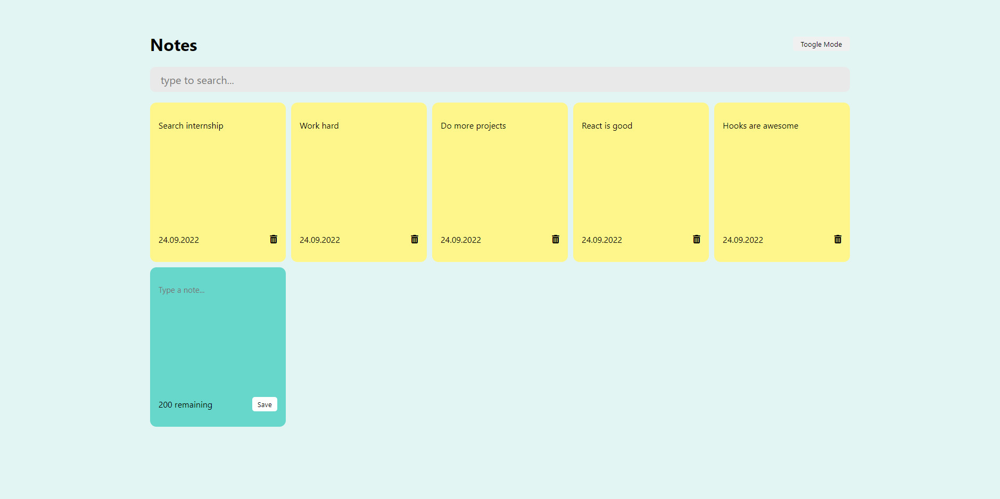
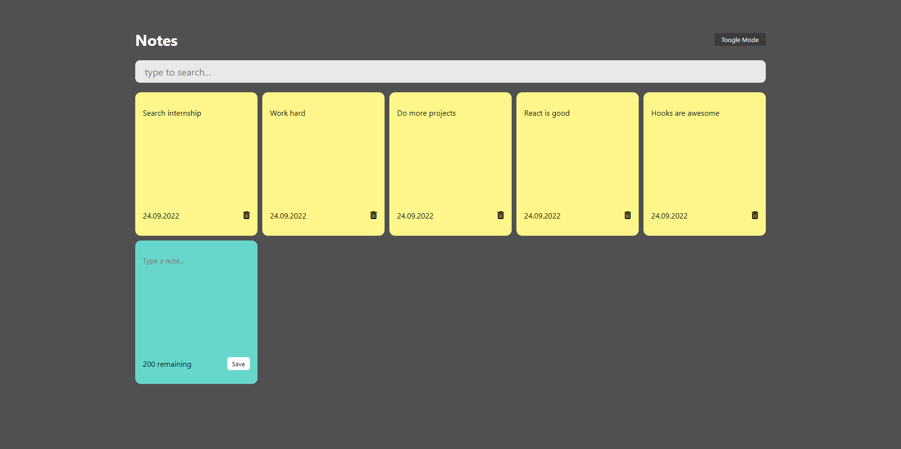

# Responsible Note App


Live website: https://fatihbulbul1.github.io/react-note-app/

```
npm install
npm start
```

# Overview
Made by:
- **React**
- HTML
- CSS
- CSS Grid

### Fonts
```css
  font-family: -apple-system, BlinkMacSystemFont, 'Segoe UI', 'Roboto', 'Oxygen',
    'Ubuntu', 'Cantarell', 'Fira Sans', 'Droid Sans', 'Helvetica Neue',
    sans-serif;
```

## Description 
- Responsive note app made by React. 
- Notes saved to local storage.
- Toogle mode to switch between dark and light mode.


### Author
- LinkedIn - [Ömer Fatih Bülbül](https://www.linkedin.com/in/ömer-fatih-bülbül-74a890236/)
- Twitter - [fatihbulbul91](https://twitter.com/fatihbulbul91)
